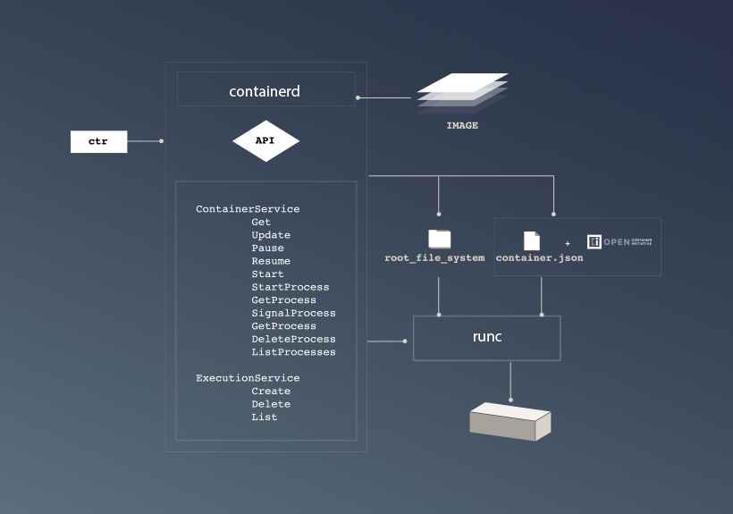
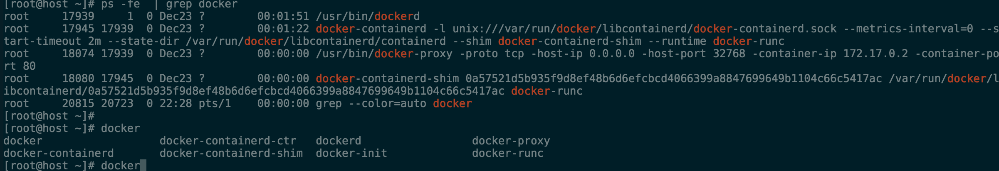
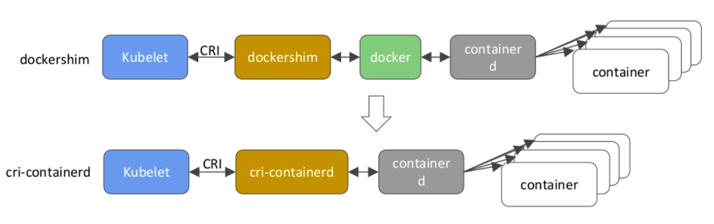
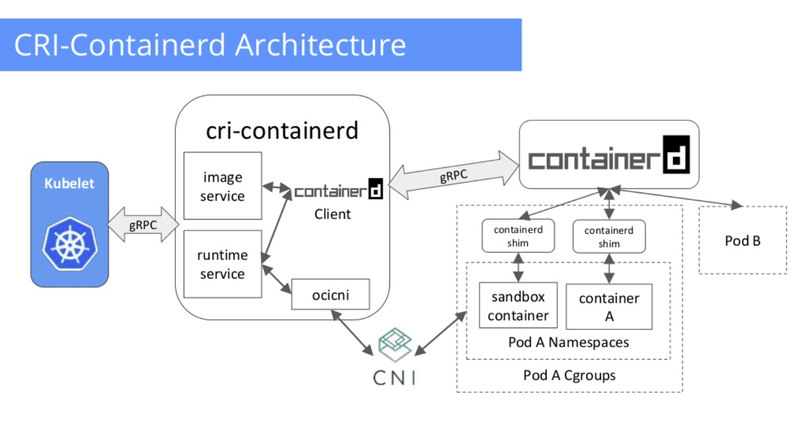
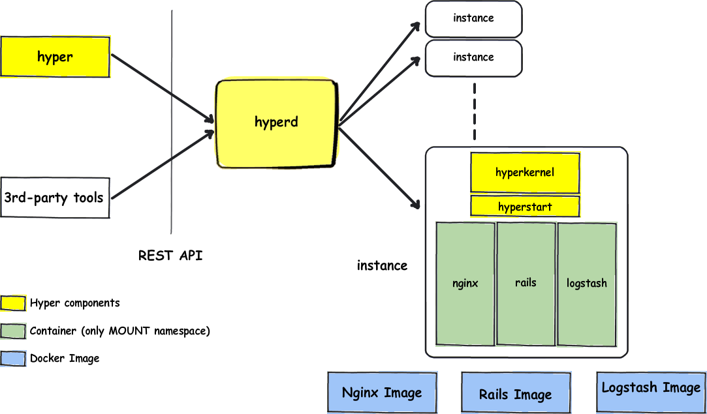

从chroot，control groups，lxc，warden，一路走到如今的docker、rocket、windows container、hyper，容器技术才算是真正的走向了大规模应用。详细的容器技术发展历史可以参考下面这篇文章

>[容器技术发展历史](https://dzone.com/articles/evolution-of-linux-containers-future)

本文主要从宏观的角度，梳理Docker与hyper这两种container runtime及其相关生态的一个关系，帮助感兴趣的人建立一个整体的印象。

# Docker
Docker一路走来，从独立发展到参与开放容器规范的建设，自身架构也在不断调整与完善，逐渐走向了更加规范和生态化的道路。宏观上看，Docker Engine是一种client/server架构，server端，也即是daemon,由一个后台常驻进程dockerd构成。对外提供REST API，整体架构如下图所示。

自1.11版本起，Docker全面调整模块架构，成为了第一个符合OCI规范的容器运行时。具体来说，Docker Engine目前是基于containerd和runc构建的。下面详细介绍相关OCI规范、runC、containerd。

## 什么是OCI规范
OCI(Open Container Initiative)致力于建立一个容器运行时和镜像格式的规范，其核心目的在于避免容器生态的分化，确保在不同容器引擎上构建的容器可以相互兼容。这是容器可移植性的根本保证。虽然Docker目前是容器的事实规范，但随着时间的推移，会不断涌现一些其他的容器引擎，这个时候就很有必要来定义一下“什么是一个容器”，保证不同的实现遵循一些共同的东西。这既是OCI期望做的事情。

- runtime spec

OCI Runtime Specification，主要定义如何container配置、执行环境以及container生命周期。

- image spec

OCI Image Format Specification，主要定义一个OCI image由一个manifest, 一个image index (optional), 一组filesystem layers, 以及一个configuration组成。该规范的目的在于确保能构建一套不同容器引擎间可互操作的工具，用于镜像的构建、传输，以及镜像运行准备工作。

有关OCI详细资料，可参考其[官方网站](https://www.opencontainers.org/)

## 什么是runC
在早期的Docker Engine中，主要用LXC工具来运行和管理容器；后来采用自研的libcontainer来做这类事情，libcontainer直接使用Linux内核提供的相关隔离技术，比如cgroups、namespace等等。

runC是一个轻量级的工具，做且只做一件事情，那就是运行一个容器。由libcontainer演变而来，并且由Docker捐献给Linux基金会，作为OCI的参考实现。

有关runC详细资料，可参考其[github repo](https://github.com/opencontainers/runc)

## 什么是containerd

2016年12月14日，Docker公司宣布将containerd从Docker Engine中分离，并捐赠到一个新的开源社区独立发展和运营，"一个工业标准的容器运行时，注重简单、 健壮性、可移植性"。containerd可以作为daemon程序运行在Linux和Windows上，管理机器上所有容器的生命周期。

Docker 1.11的Docker Engine里就包含了containerd，而现在则是把containerd从Docker Engine里彻底剥离出来，作为一个独立的开源项目独立发展，目标是提供一个更加开放、稳定的容器运行基础设施。和原先包含在Docker Engine里containerd相比，独立的containerd将具有更多的功能，可以涵盖整个容器运行时管理的所有需求。

containerd并不是直接面向最终用户的，而是主要用于集成到更上层的系统里，比如Swarm, Kubernetes, Mesos等容器编排系统。containerd以Daemon的形式运行在系统上，通过unix domain docket暴露很低层的gRPC API，上层系统可以通过这些API管理机器上的容器。每个containerd只负责一台机器，Pull镜像，对容器的操作（启动、停止等），网络，存储都是由containerd完成。具体运行容器由runC负责，实际上只要是符合OCI规范的容器都可以支持。

- 整体架构

- 模块分层

有关详细信息可参考[官网](https://containerd.io/)和[github项目主页](https://github.com/containerd/containerd)

## Docker如何组合上述组件

先看上面这张图，docker目前被分成了4个独立部分，engine管理镜像，通过containerd，containerd调用containerd-shim，containerd-shim调用runc启动容器。containerd只与容器打交道。图中列出的每个组件，都有一个独立的二进制可执行文件与之对应，如下所示

# Kubernetes on Docker
基本的容器runtime还远远不能满足大规模应用的需求，典型的诉求就是容器的编排管理系统，Docker公司自身的swarm，google的kubernetes，以及mesos marathon就是这类编排系统。经过这几年的发展，kubernetes大有一统江湖的趋势，kubernetes本身与docker的结合方式也在不断的变化，自身的定位也逐渐在往通用性容器编排调度系统发展，所以k8s一直在探索如何兼容更多的container runtime，CRI就是在这种背景下诞生的。

## CRI
从1.5版本开始，kubernetes引入了CRI(Container Runtime Interface)，可参考[Introducing Container Runtime Interface (CRI) in Kubernetes](http://blog.kubernetes.io/2016/12/container-runtime-interface-cri-in-kubernetes.html)，其核心目的在于通过一种标准的方式来集成各种不同容器runtime。并且是一种可插拔的架构，可以在不改变kubernetes的前提下，使用不同的container runtime。在CRI之前，不同的container runtime（docker/rkt等）集成到kubelet是通过在kubelet中实现一个高层接口来完成的，之前叫做OCID，CRI-O则是完全聚焦与OCI兼容的container runtime和container images。

## CRI-containerd
CRI-containerd则是基于containerd的CRI实现，目前是kubernetes的一个孵化项目，kubernetes 1.8中已进入beta版本。主要用于替代前期基于dockerd的CRI实现。

- kubelet从dockershim向cri-containerd迁移

- CRI-containerd架构

所以在这种新型架构下，kubelet直接通过基于containerd的CRI实现(CRI-containerd)与docker-containerd交互，以实现container的管理。

# hyper container
鉴于docker是共享宿主机的内核，所以在安全性方面有天然的弱势。传统的虚拟机则属于内核相互隔离的。那么能否结合二者的优点呢，答案就是hyper container。

hyper container主要有4部分构成，hyperctl客户端，hyperd，hyperkernel，hyperStart。整体架构如下图所示

hyper container直接使用OCI镜像规范，hyper的runtime是基于hypervisor的[runV](https://github.com/hyperhq/runv)，兼容OCI runtime规范，但是由于hypervisor和container的天然区别，OCI中有部分规范在hyper里是没有的，详情可参见github项目主页。

类似hyper的还有intel开源的[clearcontainers](https://github.com/clearcontainers)

# 小结
容器生态正在走向规范化，结和虚拟机和container二者优势的hyper正在快速发展，编排系统kubernetes正在稳步成熟，周边生态也在不断完善，CNCF家庭成员也在不断壮大，微服务理念也逐步深入人心，service mesh技术正在高速发展...一切值得期待
